<!--section: 1-->
作为引言，讲一下我创造 JustWrite 这个库的起因，其目的是引起读者的共鸣。在这里就要提到其他编辑器没有解决的问题，供后文渲染本库的优势。这一段不要太长。

<!--section: 1.1-->
欢迎来到 JustWrite 写作库，这是由@**西郊次生林**基于 Obsidian 打造的一个一站式写作平台，提供了丰富的功能，能够有力地支持小说、文章写作，并且支持导出到多个平台。

作为一个自媒体人，我长时间混迹于媒体领域，在公众号|少数派|知乎等平台以及各大论坛都发布过许多文章。然而我发现文章作者显然是个无人关注的群体，我尝试过各种写作软件，居然没有找到一款能基本覆盖我的需求的软件。现有的写作软件几乎都不能完全解决下面这些问题：
1. **写作体验不好**：以秀米为代表的这类软件侧重于排版，并没有太关注写作的体验；
2. **不方便发布到平台**：以 PureWriter 为代表的关注写作体验的软件不支持把文章导出到平台进行发布，也无法复制带有排版的文章粘贴到平台编辑器；图片更是需要逐个手动上传；
3. **要价高昂**：支持丰富的写作模式的软件往往价格昂贵，比如 Gingko Writer 的月费达到了 12.75 美元（折合人民币 92.46 元）；~~写作本来就不赚什么钱，这下更加雪上加霜~~；
4. **数据安全焦虑**：一些小开发者团队开发了一些很不错的写作网站，但是其要求数据完全存储在云端，用户能不能找到数据取决于网站是否有人持续维护；我就曾因为网站突然停止维护丢失过文章；
5. **平台限制**：许多优秀的写作软件限定 macOS，不提供 Windows 端或是 Windows 端功能不完善（在此点名批评 IA Writer），而我是一个赚不到足够钱买 MacBook 的业余作者。

在一次次体验各种写作软件迎来一次次失望后，我决心使用我熟悉的 Obsidian 定制一款专为文章作者打造的写作软件。于是就有了这个——Obsidian JustWrite。

<!--section: 2-->
将前文提到的缺点总结为一组需求，再相应地提到自己的优点以及优点是如何满足这些需求。这一段不要太长，要让位于主体部分。

<!--section: 2.1-->
# JustWrite功能特性
我这样的自媒体文章作者的写作需求如下：
1. 不仅要支持传统的「一气呵成」式线性写作，最好还要支持灵活的**非线性写作**；这对于需要反复调整文章结构或是需要针对不同平台做适配的作者非常重要；
2. 要方便发布到各个平台；如果不能实现一键发布，那至少也要可以方便地手动粘贴到各个平台的编辑器进行发布；我不能接受粘贴文本后还要一个一个手动上传图片；
3. 成本不能太高；我不能接受每个月花接近 100 元购买一个写作软件，更不能接受为了某个写作软件花几千到上万买一台 MacBook；
4. 保证数据安全；数据最好完全保存在本地，始终保证我不会丢失我辛苦写作的成果不会被软件绑定。

总结了需求之后，我基于 Obsidian 着手配置了我自己的写作软件，并将之命名为 JustWrite。JustWrite 本身**完全免费**，适合于文章以及小说作者，其支持的特性包括：
1. **非线性写作**：不再从头到尾写文章，而是先写作大纲，再根据大纲写作一个个卡片，让文章像树一样生长出来，帮助你减轻创作压力，轻松创作出结构清晰、逻辑严密的文章（由 Lineage 提供支持）；
2. **长文写作**：支持分章节写作长文以及一键拼接导出，适合于小说作者（由 Longform 提供支持）；
3. **一键复制带排版的文章到平台编辑器**：写好的文章支持一键复制、粘贴到公众号、知乎等平台，文中图片将会被自动上传到平台，无需手动上传（由 NoteToMP 以及 Image Auto Upload 提供支持）；
4. **一键导出为长图/组图**：支持一键导出文章为图片，适合于分享以及发布到小红书等平台（由 Export Image Plugin 提供支持）；
5. **一站式写作+绘图**：支持在 JustWrite 内绘制手绘风格示意图（由 Excalidraw 提供支持）；
6. **数据本地存储+备份+同步+版本控制**：Obsidian 本身会将数据存储在本地，而 Git 可以一次性实现备份、同步、版本控制三大功能。

不过需要注意的是，**JustWrite 并非开箱即用**，要实现上述所有功能还需要你进行一定的配置。这实属无奈之举，享受了体验和廉价就几乎必然丧失方便。好在配置的过程并不复杂，我会在本文中附上所需的教程，按照教程你只需要很少的时间就可以拥有自己的完整版 JustWrite 啦！

此外，**虽然 JustWrite 本体免费，但是为其功能提供支持的插件并非完全免费。不过这些插件的免费功能就已经足够支持上述所有特性，付费则可以在此基础上获得更好的体验**。在此感谢为 JustWrite 提供功能支持的各位 Obsidian 插件作者以及相关教程作者！

<!--section: 3-->
分模块介绍本库的主要功能：
1. 非线性写作；
	1. 从写作大纲的例子引出非线性写作；
	2. 讲述 Gingko 式树形写作以及 Lineage；
	3. 强调一下快捷键的重要性，截图演示一下实际操作。
2. 长文写作以及导出；
3. 导出到微信公众号以及导出图片；
4. 一站式写作+绘图；
5. 本地存储以及备份+同步。

<!--section: 3.1-->
# 功能模块
## 非线性写作
如果我问写一篇文章该怎么做，一般人肯定会说从第一个字写到最后一个字就好了。这就是线性写作，是我们一直以来形成的习惯，很符合人的直觉。

如果是有经验的作者，可能会说**先写作一个大纲，想好要写什么，然后再动笔**。就如老舍先生所言：
> 我们必须先有个决定。有了决定，才能布置这篇报道的全局。要不然，就会东一句西一句地随便扯，不能成为好文章。**尽管我们要只写二三千字，也须先写出个提纲，安排好头一段说什么，第二段说什么……。有了提纲，心里有了底，写起来就能顺理成章；先麻烦点，后来可省事**。
> 
> ——老舍，选自一九五四年工人出版社《和工人同志们谈写作》

本文就是用大纲写作的思路写的，本章的大纲如图：
在大纲写作的思路下，写作过程就不再是从前到后的线性式写作了，而变成了非线性的树状。于是非线性写作这一概念就诞生了。

非线性写作的好处在于可以很方便地控制文章结构，保持逻辑严密。有些作者还会在大纲的基础上拓展出一层细纲，这样他们的写作过程就变成了三层树状结构。

JustWrite 的非线性写作是**卡片式大纲写作**，也就是如上图一样，将大纲和文章都拆解为若干卡片，不同列的卡片之间有从属关系。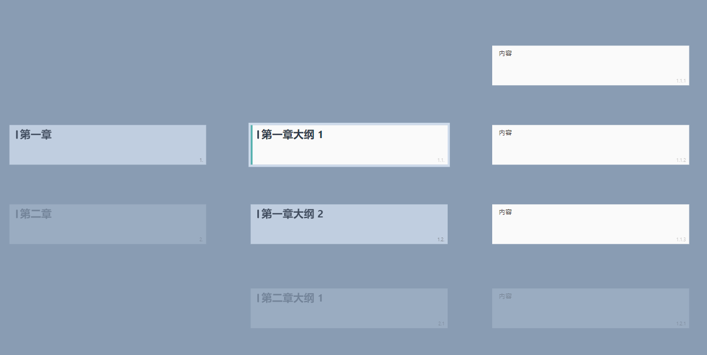
JustWrite 的非线性写作同时也是卡片写作，可以支持你将文章分散为多个卡片在视图中随意拖动、拼接。这是 Scrivener 这样的专业写作软件的招牌功能之一。新闻行业的写作经常就会采取这种卡片式写法。

要使用 JustWrite 的非线性写作，只需要打开任意一篇文章，然后点击右侧的 Lineage 符号即可。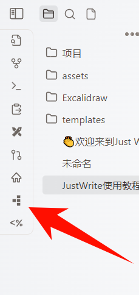
JustWrite 的非线性写作界面由各种模式，注意观察卡片右侧的条形颜色：
1. 灰色：正在编辑；
2. 红色：准备退出编辑模式；
3. 绿色：浏览模式。

的各种操作均有快捷键支持，操作起来非常便利。使用快捷键可以大大提高操作效率。

这里提几个常用快捷键：
1. Ctrl+Shift+Enter（编辑模式）：保存当前卡片并且退出编辑模式；（**注意，修改必须手动保存**）
2. Ctrl+上下左右（浏览模式）：向上下左右方向创建新卡片；
3. Enter（浏览模式）：编辑当前卡片；
	1. Alt+Enter：编辑当前卡片并且把光标放到最后；
	2. Shift+Enter：编辑当前卡片并且把光标放到开始；

编辑完毕之后，点击右上角「导出此列」，即可将这一列的卡片拼接为一篇完整文章。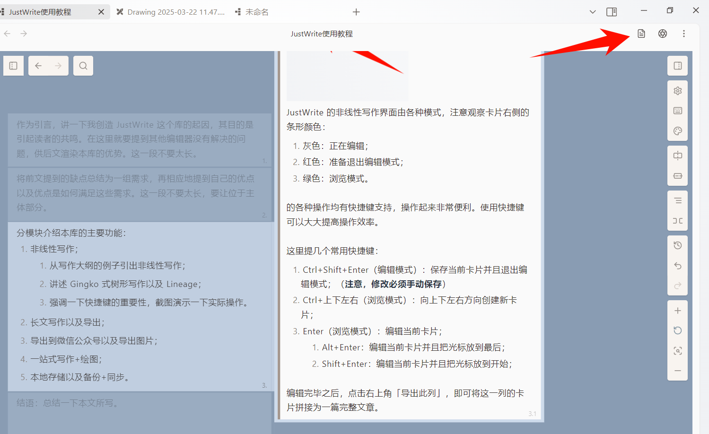

<!--section: 3.2-->
## 长文写作
长文写作是 Obsidian 本身的一块短板。Obsidian 基于 Zettelkasten 卡片笔记的思路研发，而卡片笔记并不在意卡片如何存放。因此 Obsidian 默认的文件列表连自定义排序都不支持，你要写作分章节存储为多个文件的长文，只能在章节文件名前面加上数字标号。

然而即使依靠加上了数字标号实现了排序，但是长文的导出仍然是个问题。你必须手动复制粘贴每一个章节的内容到一个文件里面，有时候还要手动调整大纲序号，非常麻烦。

JustWrite 使用 Longform 来支持长文写作。在文件管理器中任意右键点击一个文件夹，即可在文件夹中新建一个 longform 长文项目：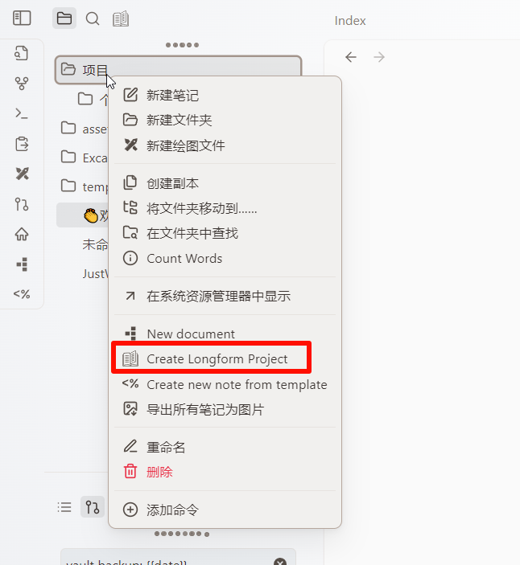
Longform 将一个文件称作一个 scene，多个文件组成的长文应该选择 multi-scene 项目。建立项目后，你就可以点击左上角的书籍符号找到 longform 项目界面了：
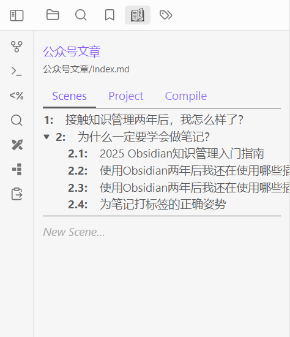
在 scenes 界面里面，你可以创建新章节，也可以拖动章节形成自定义排序以及多级结构，也可以作为长文大纲使用。

在 Project 处，你可以创建草稿、选择创建新章节使用的模板（结合 Templater 使用）。Longform 还会帮助你统计项目的字数，并且可以设立每日写作目标，实现监督。
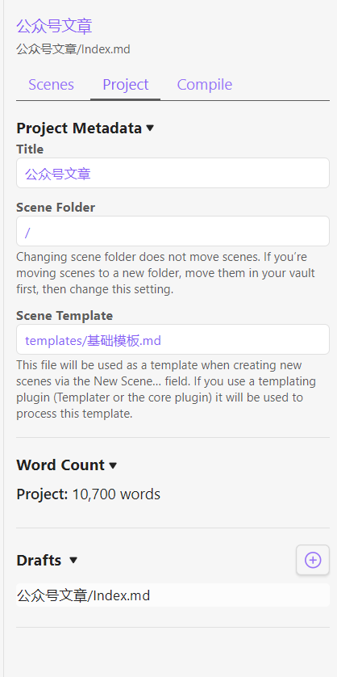
编译 Compile 则可以将分散在项目中各个文件中的章节拼接、处理、导出。编译之后，你的长文会被处理之后按规则拼接起来，形成一整个长文手稿（`manuscript.md`）。手稿可以直接导出为 PDF，或者使用 pandoc 导出为 word。

此外，编译流程也可以自己定义，满足不同的导出要求。
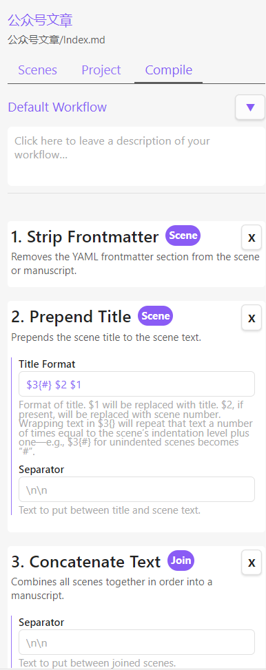
我用 Longform 完成过许多长文系列作品，但是 longform 仍然是个小众插件，因此我认为 longform 值得我再次推荐。这是我用 longform 完成的图形学系列：
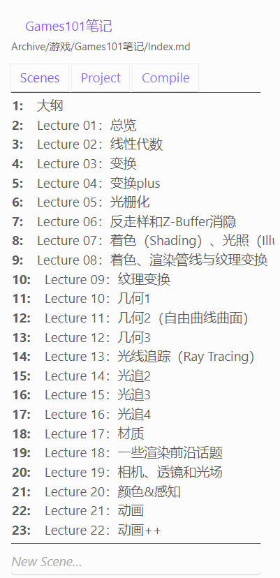
概率论与数理统计：

数学 2 笔记：
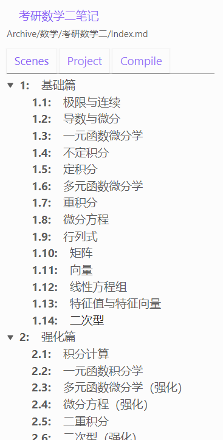

<!--section: 3.3-->
## 导出 & 发布
文章的导出与发布是文章作者的一大痛点。大多数平台都有自己的在线编辑器，但是却往往不那么好用。比如微信公众号的默认在线编辑器的排版效果极差，养活了一大批公众号排版软件。但是像我一样的许多作者并不追求高级排版，而是更希望专注于内容，尽量少将精力放在排版上面。在这个背景下，我开始思考能不能直接导出 Obsidian 中的文章，最终我找到了 NoteToMP 这一插件，可以一键复制带有排版的文章，并且粘贴到包括微信公众号在内的各家编辑器：
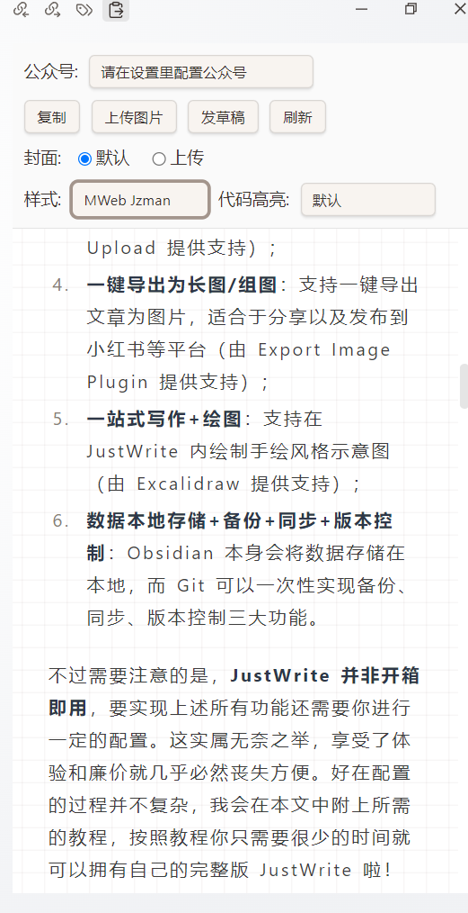
直接使用 NoteToMP 插件复制文章并不能一并复制文章中的图片，你还是需要复制到平台编辑器后手动上传图片。要解决这一问题，你有两个选择：
1. 购买 NoteToMP 作者 Sunbooshi 的付费服务，支持在 Obsidian 内一键上传图片到公众号，从此彻底解放双手；付费服务主要用于购买上传图片所需的云服务器，年费会员为 72 元（平均每月 6 元，收费不高）；
2. 购买云存储服务，自行搭建图床。

如果你选择后者，则需要自行安装开源图床工具 picgo ，使用 Image Auto Upload 插件（JustWrite 已包含）自动上传粘贴的图片。图床配置可以参照[这篇教程](https://forum-zh.obsidian.md/t/topic/388)完成。

为了保证图片可用，避免出现图片失效的情况，包含微信公众号、少数派、知乎在内的平台在线编辑器都会试图下载文中的图片将其托管到平台的 CDN。因此不必担心你的文章被大量访问造成的流量费用，以及图片链接会暴露在公网中遭受恶意攻击。

> [!warning]
> 图床选择上，我比较推荐腾讯云。一方面是因为微信公众号这样的平台托管图片可能对图片来源有一定要求；另一方面是因为腾讯云会赠送新人 50G 流量（为期半年），对于图床来说已经绰绰有余。

配置图床完成后，就可以轻松实现「一次写作，多方发布」了。配置 JustWrite 对于没有 MWeb 可以用的 Windows 用户以及不想付出高昂费用的 Mac 用户不失为一个不错的选择。

如果你同时是小红书博主，需要将文章转换为组图来发布，JustWrite 也支持自动将文章截图并且分割为组图导出。只需要选择页面右上角的「导出为图片」即可进入导出界面，支持导出为长图或一个组图压缩包：
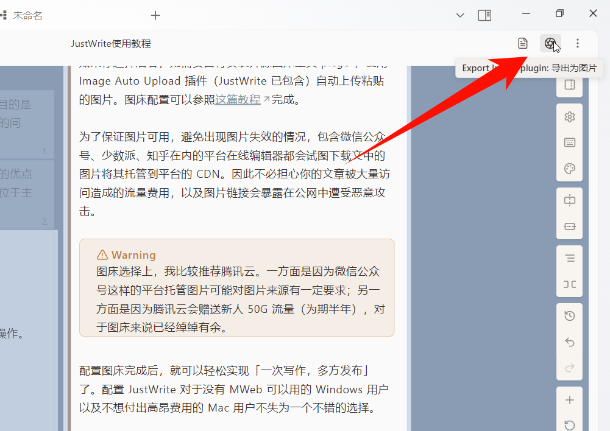
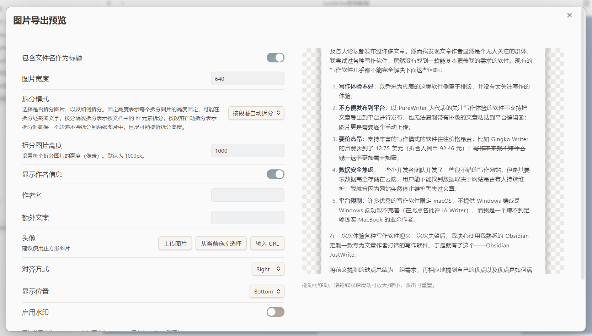

<!--section: 3.4-->
## 绘图
除了写作之外，JustWrite 还配备了 Excalidraw 来绘制简单的示意图。Excalidraw 是广受好评的手绘风格示意图绘制软件。我以往文章包括本文中的许多示意图就是使用 Excalidraw 绘制的。
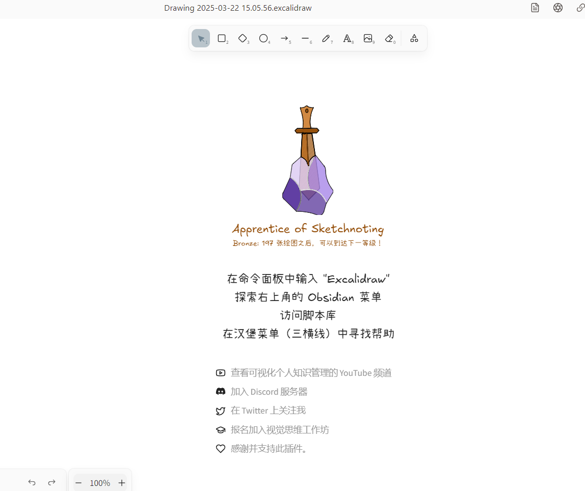
我并非是 All In One 主义的拥趸，但是 Excalidraw 确实和 Obsidian 相辅相成，因此我将 Excalidraw 也加入到了 JustWrite 中。你完全可以使用你更熟悉的绘图软件替代 Excalidraw，比如 Draw.io 等。

<!--section: 3.5-->
## 本地存储+备份与同步
在这之前，我一直都在使用一些在线 markdown 编辑器编辑文章。这些在线编辑器大多数由小开发团队运营，所有文字图片数据需要完全托管在云端。这本来不成什么问题，但是有一天，我发现网站突然打不开了，随之而去的还有我几个星期以来写的全部文章。从这里开始，我意识到写作数据是一笔很宝贵的财富，务必要牢牢掌握在自己手里。如果有可能，最好还是要选择本地化存储、开源格式的写作软件来创作内容。借了 Obsidian 的光，JustWrite 所有数据都存储在本地，不会因为停止维护而变得不可用。

JustWrite 的备份、同步以及版本管理功能均由 Git 实现。使用 Git 实现同步和版本管理的教程已经有很多，具体可以参照我之前的文章：
1. [适合普通用户的简明Obsidian Git同步教程](https://sspai.com/post/97316)
2. [为什么笔记用户要保卫自己的「数字主权」](https://sspai.com/post/96863)

<!--section: 3.6-->
## 其它细节特性
1. 高效的公式编辑，适合理工科内容（LaTeX Suite，使用方法可以参照[一个简单功能，让你不再为公式编辑发愁](https://sspai.com/post/96782)）；
2. Easy Typing 带来的丰富编辑特性；
3. Templater 模板（配合 longform）；
4. Obsidian 原生的卡片笔记特性（适合组织写作材料）；
5. 打字机模式以及 Zen 模式。

<!--section: 4-->
结语：总结一下本文所写。

<!--section: 4.1-->
# 结语
对于文章作者来说，当前主流的写作软件都具有各种各样的痛点。为此，我基于 Obsidian 定制了一个专为文章以及小说写作服务的库，命名为 JustWrite。使用 JustWrite 可以轻易实现 markdown 排版以及复制到各家平台，并且还支持非线性写作以及长文写作功能，真正做到排除干扰，让作者专注于内容， just write。

我是@西郊次生林，感谢你的阅读。